# Лабораторная работа №2:  Loki + Zabbix + Grafana

## Цель и задачи: 
- Подключить к тестовому сервису Nextcloud мониторинг + логирование. Осуществить визуализацию через Grafana

## Часть 1. Логирование

Первым делом в директории проекта был создан yml файл, согласно примеру, который содержит в себе все необходимые сервисы: nextcloud, loki, promtail, grafana, zabbix (+ бд Postgres для него).
В volumes добавлена ```grafana-data:```, поскольку далее из-за её отсуствия возникала ошибка

```
services:
  nextcloud:
    image: nextcloud:29.0.6
    container_name: nextcloud
    ports:
      - "8080:80"
    volumes:
      - nc-data:/var/www/html/data

  loki: #сервис обработки логов
    image: grafana/loki:2.9.0
    container_name: loki
    ports:
      - "3100:3100"
    command: -config.file=/etc/loki/local-config.yaml #запуск с дефолтным конфигом

  promtail: # сборщик логов
    image: grafana/promtail:2.9.0
    container_name: promtail
    volumes:
      - nc-data:/opt/nc_data
      - ./promtail_config.yml:/etc/promtail/config.yml
    command: -config.file=/etc/promtail/config.yml

  grafana: # сервис визуализации 
    image: grafana/grafana:11.2.0
    container_name: grafana
    environment:
      GF_PATHS_PROVISIONING: /etc/grafana/provisioning
      GF_AUTH_ANONYMOUS_ENABLED: true
      GF_AUTH_ANONYMOUS_ORG_ROLE: Admin
    ports:
      - "3000:3000"
    volumes:
      - grafana-data:/var/lib/grafana
    command: /run.sh

  postgres-zabbix:
    image: postgres:15
    container_name: postgres-zabbix
    environment:
      POSTGRES_USER: zabbix
      POSTGRES_PASSWORD: zabbix
      POSTGRES_DB: zabbix
    volumes:
      - zabbix-db:/var/lib/postgresql/data
    healthcheck:
      test: ["CMD", "pg_isready", "-U", "zabbix"]
      interval: 10s
      retries: 5
      start_period: 5s

  zabbix-server:
    image: zabbix/zabbix-server-pgsql:ubuntu-6.4-latest
    container_name: zabbix-back
    environment:
      POSTGRES_USER: zabbix
      POSTGRES_PASSWORD: zabbix
      POSTGRES_DB: zabbix
      DB_SERVER_HOST: postgres-zabbix
    ports:
      - "10051:10051"
    depends_on:
      - postgres-zabbix

  zabbix-web-nginx-pgsql:
    image: zabbix/zabbix-web-nginx-pgsql:ubuntu-6.4-latest
    container_name: zabbix-front
    environment:
      POSTGRES_USER: zabbix
      POSTGRES_PASSWORD: zabbix
      POSTGRES_DB: zabbix
      DB_SERVER_HOST: postgres-zabbix
      ZBX_SERVER_HOST: zabbix-back
    ports:
      - "8082:8080" # можно любой, оставляем как в примере
    depends_on:
      - postgres-zabbix

volumes:
  nc-data:
  grafana-data:
  zabbix-db:
```

Также был создан фйал `promtail_config.yml`, для конфигурации промтейла, описывающий порты и пути для получения и записи логов:

```
server:
  http_listen_port: 9080
  grpc_listen_port: 0

positions:
  filename: /tmp/positions.yaml

clients:
  - url: http://loki:3100/loki/api/v1/push #адрес, куда будут приходить логи

scrape_configs:
- job_name: system
  static_configs:
  - targets:
    - localhost
    labels:
      job: nextcloud_logs #имя, для индексирования
      __path__: /opt/nc_data/*.log #неполный путь
```

Далее запускаем с помощью `docker-compose up -d` и сразу проверяем через `docker ps`

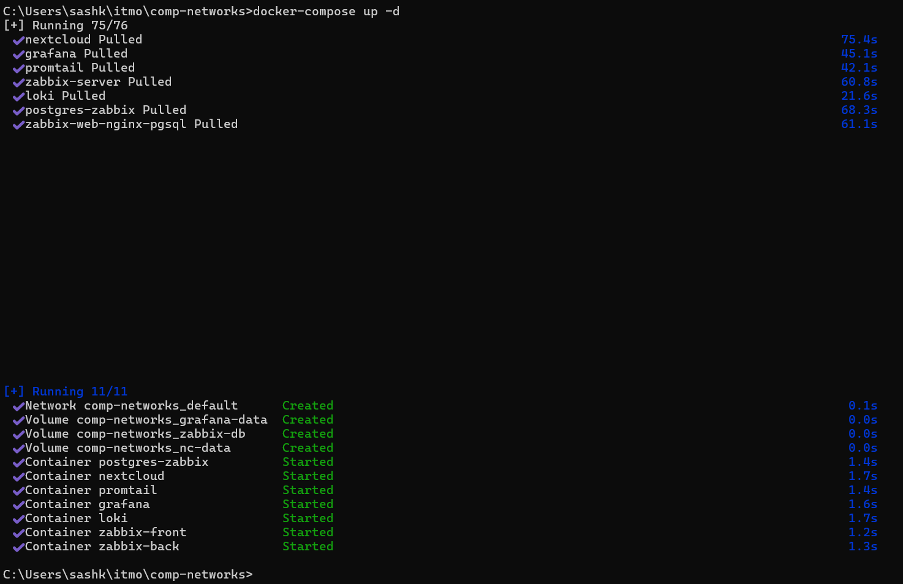

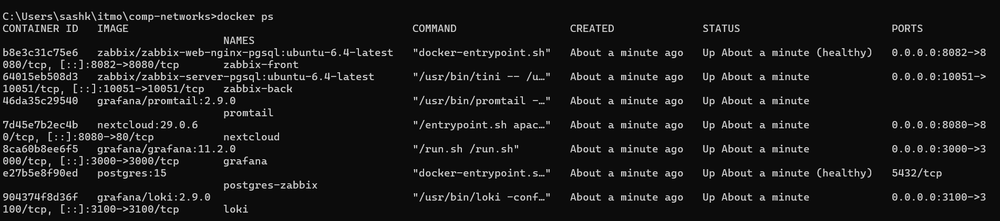

Всё успешно, идём дальше.

Переходим по ссылке https://hocalhost:8080 на веб-сервис nextcloud, регистрируемся, ждём установки БД.

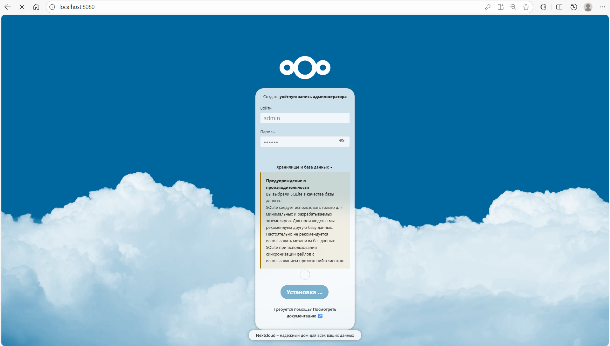

Проверяем двумя способами, что логи отправляются.

Изначально возникли проблемы, не отобржались нужные логи.

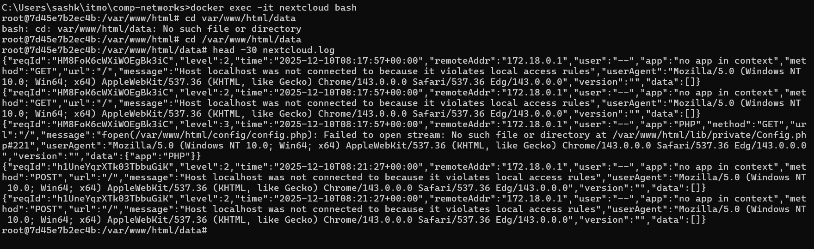

> Чтобы исправить, выполнили: ``` docker exec -u www-data nextcloud php occ config:system:set trusted_domains 0 --value="localhost"```

Получаем: ` System config value trusted_domains => 0 set to string localhost ` (то есть теперь localhost это trusted domain)

И перезапускаем ``` docker restart nextcloud ```

Теперь переходим в bash и смотрим файл с логами:

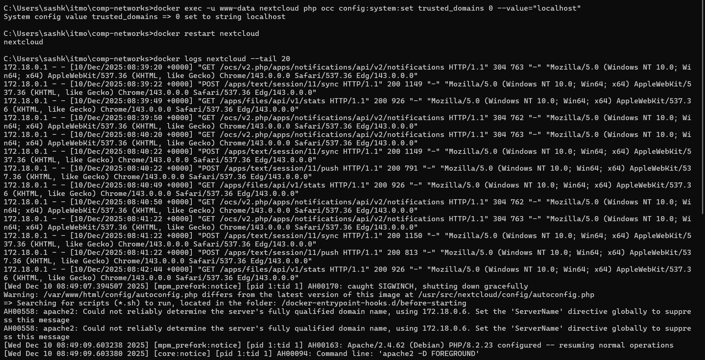

А через `docker logs promtail` смотрим логи промтейла


Всё проверили, починили, переходим дальше.

## Часть 2. Мониторинг

Настройка Zabbix (система мониторинга состояния сервиса):
* Подключаемся к `http://localhost:8082`
* Вводим логин `Admin`, пароль `zabbix`

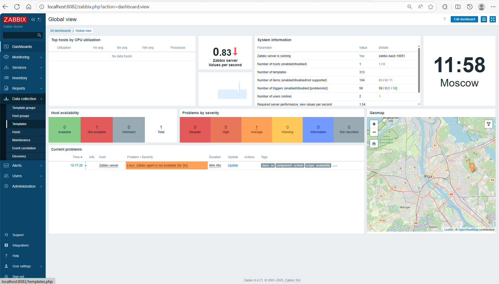

Переходим в раздел ` Data Collection - Templates `, импортируем созданный yml файл `template.yml`:

```
zabbix_export:
  version: '6.4'
  template_groups:
    - uuid: a571c0d144b14fd4a87a9d9b2aa9fcd6
      name: Templates/Applications
  templates:
    - uuid: a615dc391a474a9fb24bee9f0ae57e9e
      template: 'Test ping template'
      name: 'Test ping template'
      groups:
        - name: Templates/Applications
      items:
        - uuid: a987740f59d54b57a9201f2bc2dae8dc
          name: 'Nextcloud: ping service'
          type: HTTP_AGENT
          key: nextcloud.ping
          value_type: TEXT
          trends: '0'
          preprocessing:
            - type: JSONPATH
              parameters:
                - $.body.maintenance
            - type: STR_REPLACE
              parameters:
                - 'false'
                - healthy
            - type: STR_REPLACE
              parameters:
                - 'true'
                - unhealthy
          url: 'http://{HOST.HOST}/status.php'
          output_format: JSON
          triggers:
            - uuid: a904f3e66ca042a3a455bcf1c2fc5c8e
              expression: 'last(/Test ping template/nextcloud.ping)="unhealthy"'
              recovery_mode: RECOVERY_EXPRESSION
              recovery_expression: 'last(/Test ping template/nextcloud.ping)="healthy"'
              name: 'Nextcloud is in maintenance mode'
              priority: DISASTER
```

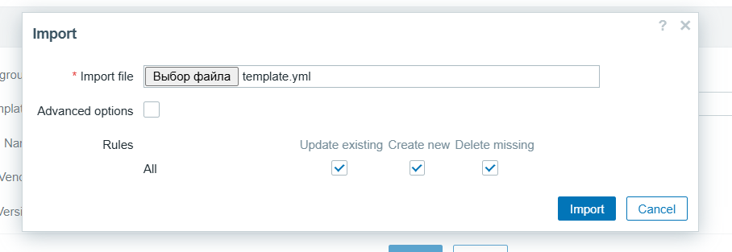

Окончательно импортируем наш template и запоминаем его название (Test ping template, далее понадобится для хоста)


Аналогично добавлению localhost в 1 части, добавляем nextcloud в trusted_domains, чтобы дать право обслуживать запросы zabbix.

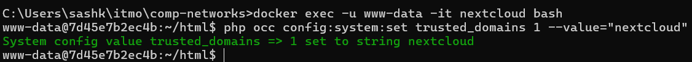

В разделе ` Data Collection - Hosts` создаем хост nextcloud, видимое название nextcloud_server, с импортированным ранее шаблоном (ищём по названию `Test ping template`), устанавливаем хост-группу `Application`:

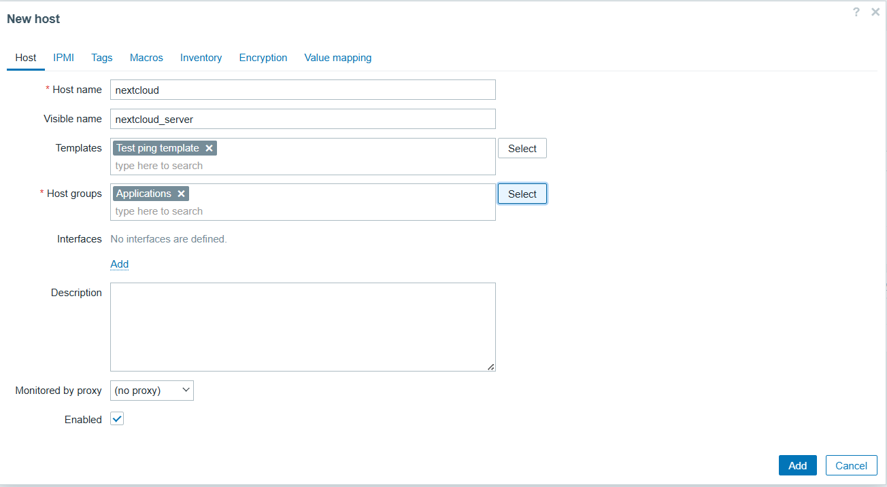

> Без подключения созданного шаблона для мониторинга Zabbix не начнёт мониторинг!

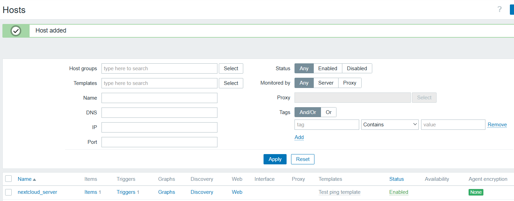

Хост создан успешно, поэтому можем переходить к мониторингу логов. Для этого в разделе ` Monitoring - Latest Data ` выбираем наш nextcloud_server. Видим, что состояние - healthy.

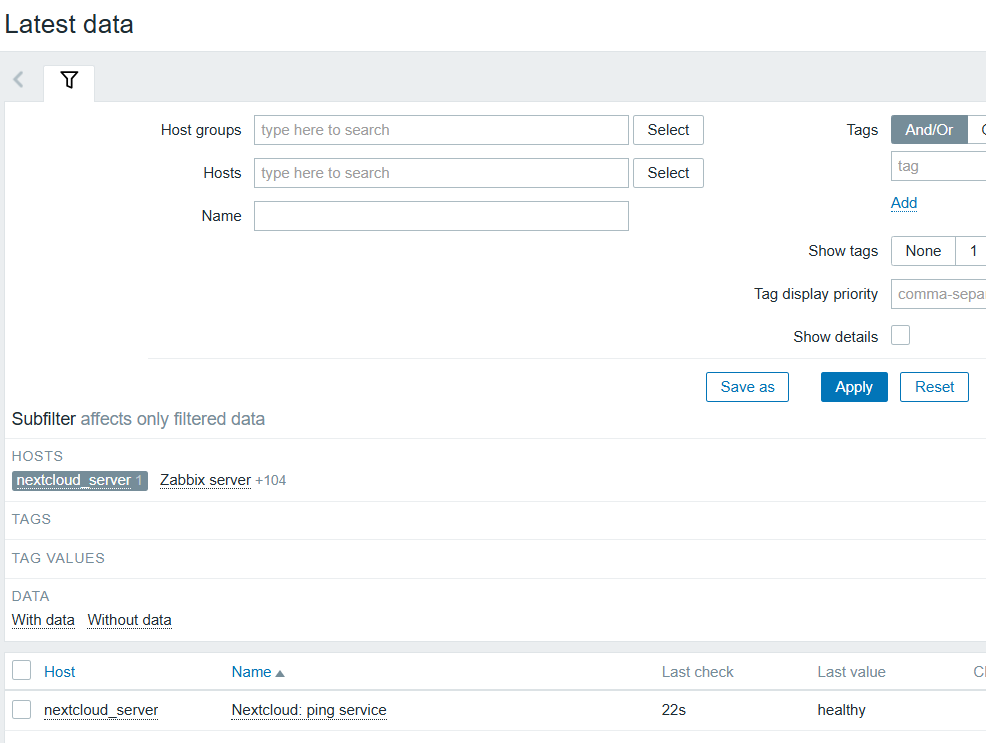

Теперь проверим, всё ли корректно работает: включим maintenance mode, чтобы отловить ошибку и посмотреть, как отреагирует система:

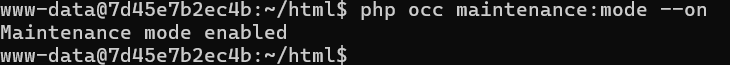

Видим, что проблема найдена, состояние поменялось на `unhealthy`:

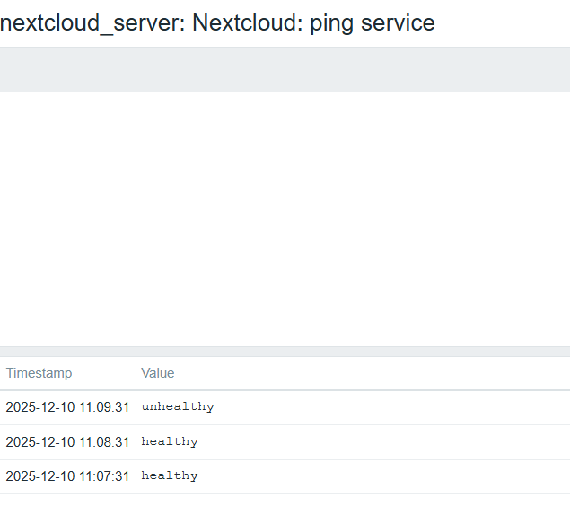

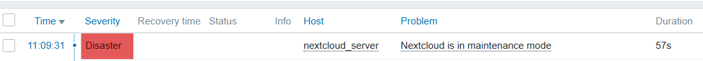

Отключим maintenance mode, наблюдаем за сервисом:

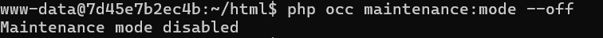


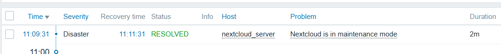

Проблема решилась (resolved)!

Теперь мы уверены, что система мониторинга подключена и оповещает о возникающих ошибках и проблемах, проверяя каждую минуту.

## Часть 3. Визуализация

Чтобы начать работать с Grafana выполним в терминале команду `docker exec -it grafana bash -c "grafana cli plugins install alexanderzobnin-zabbix-app"`, которая устанавливает плагин Zabbix в контейнер Grafana, и перезапускаем с помощью `docker restart grafana`. Без плагина Grafana не понимает, как работать с API Zabbix. А теперь может подключать Zabbix, как источник данных в Grafana и отображать данные мониторинга из Zabbix на дашбордах Grafana, в чём и заключается суть данной части работы.

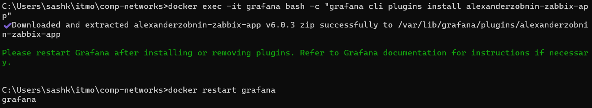

Заходим на Grafana по адресу из compose-файла (`http://localhost:3000/`):

Переходим в раздел Administration - PLugins. Активируем Zabbix (enable), чтобы потом использовать его для создания datasource.

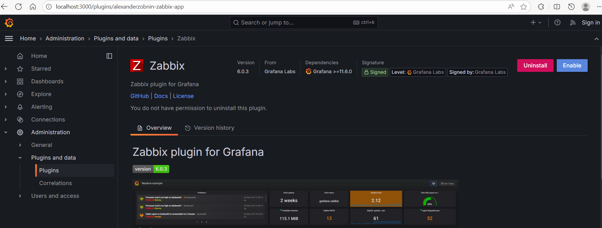

Далее нужно подключить Loki к Grafana: `Connections - Data sources - Loki`. В настройках задаем адрес `http://loki:3100` и имя `loki-datasource-lab2`, сохраняем, проеврем, что всё успещно и он предлагает нам начать визуализацию:

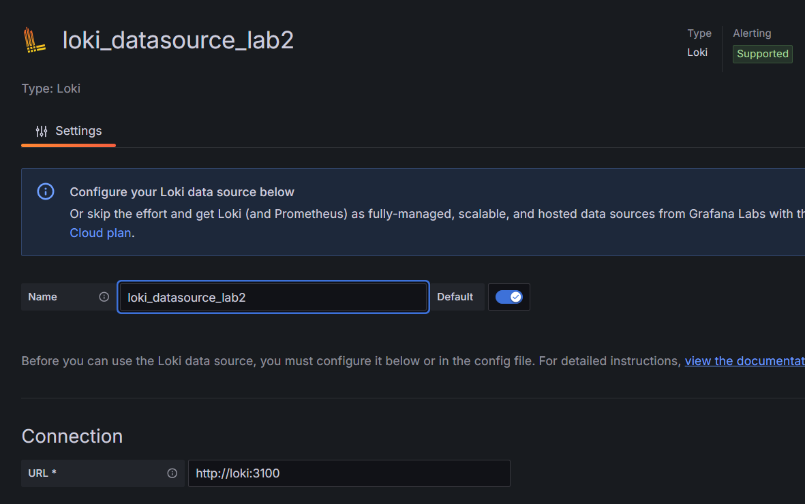

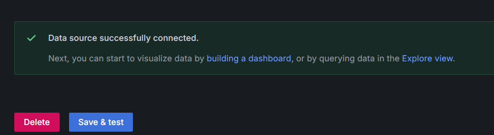

То же самое делаем с Zabbix, создаем новый datasource, в качестве url указываем `http://zabbix-front:8080/api_jsonrpc.php`, заполняем имя пользователя (`Admin`) и пароль (`zabbix`), как при авторизации в Zabbix, добавляем имя `zabbix-datasource-lab2` (можно любое) и также нажимаем  `Save&test`:

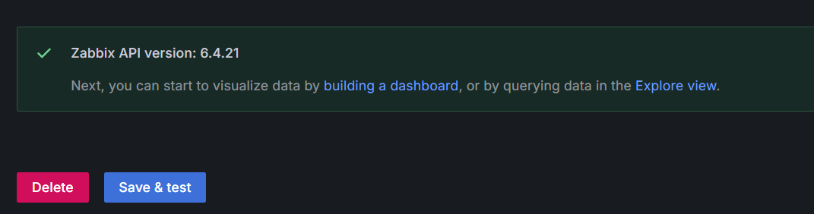

Переходим к логам: открываем вкладку Explore, в качестве источника - Loki, индекс - job, value - nextcloud_logs. Нажимаем `Run query` и `Newest first`, чтобы подгрузить наиболее поздние результаты:

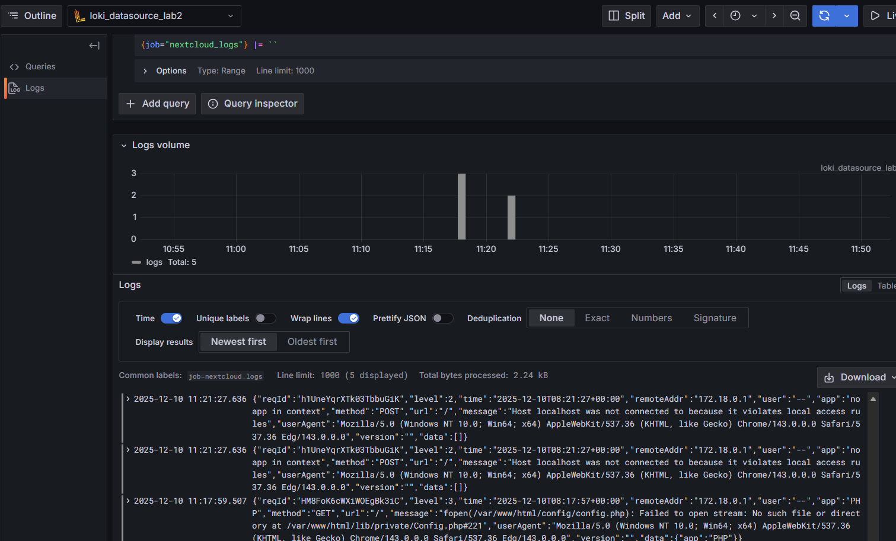

Повторяем с Zabbix, выводим в виде таблицы:


## Задание: запросы

В рамках изучения возможностей запросов, попробовали поставить `query type: Problems` для Zabbix, чтобы отследить количество проблем, нашли тот случай, когда включали `maintenance mode on`:

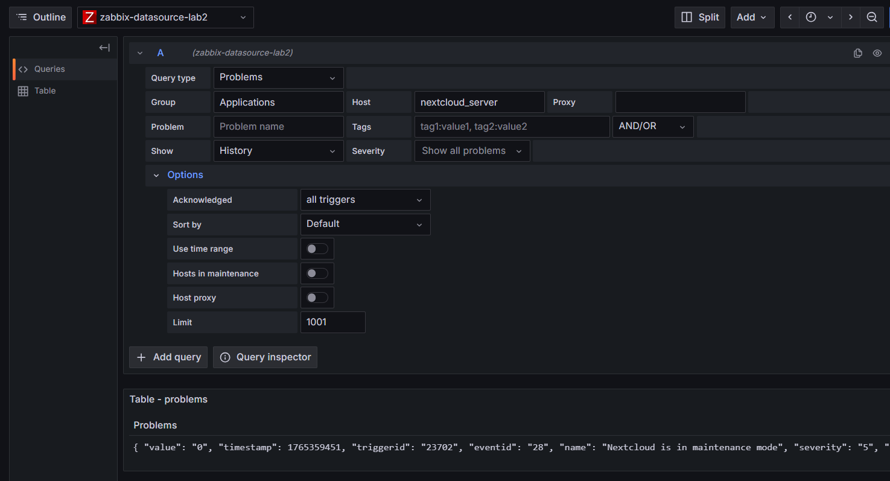

## Дашборды

Теперь переходим непосредственно к визуализации, а именно созданию дашбордов. Для построения переходим в раздел `Dashboards - New Dashboard` и создаем там новый дашборд, помещая в него столько частей и размещая их так, как хотим:

#### для Zabbix 

Так как мы имеем 2 состояния сервера: healthy и unhealthy, обозначим их разными цветами и выберем такой тип графика "status hiatory"

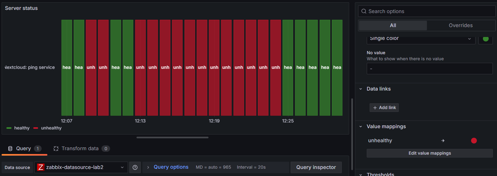

#### для логов Loki

ВЫбираем обычную таблицу для отображения логов:

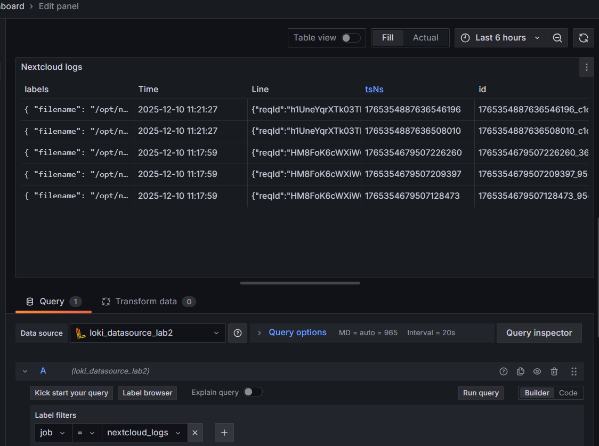

#### Итоговый дашборд №1

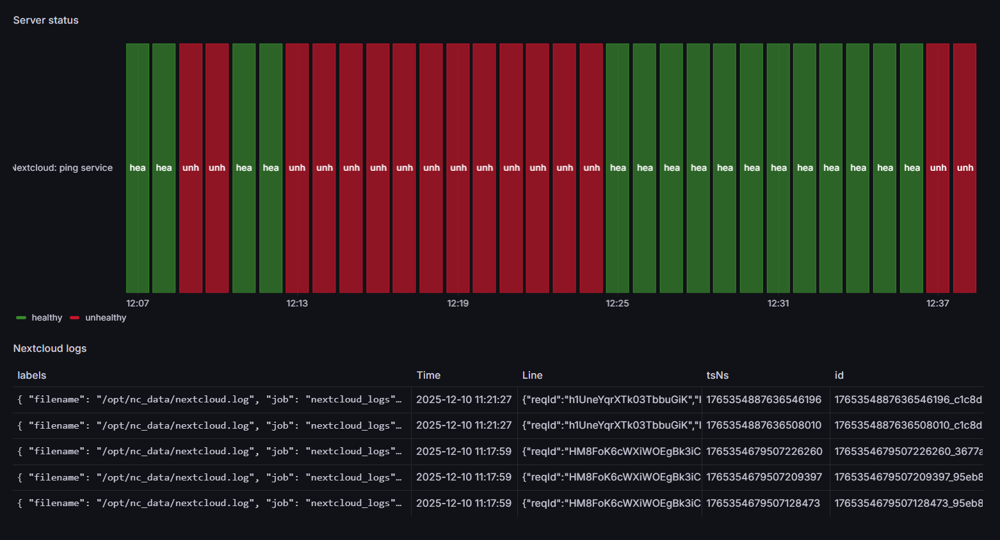

#### Итоговый дашборд №2

Для второго дашборда чуть изменим вид отображения для zabbix информации, сделаем только вывод problems, а для loki поменяем вид данных в таблице.

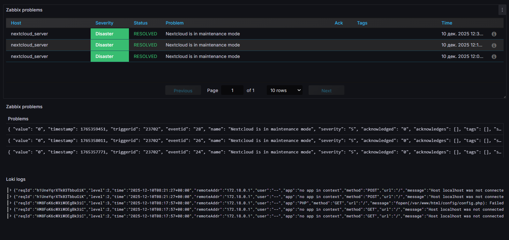


## Вопросы

1. Чем SLO (Service Level Objective - целевой уровень предоставляемой услуги/желаемое значение для SLI) отличается от SLA (Service Level Agreement - согласованный уровень качества предоставлемой услуги)?

Главное отличие в том, что **SLO** - внутренняя цель для команды , работающей над продуктом, а **SLA** - документально заверенные соглашения между заказчиком и исполнителем  (фактически включает в себя SLO, а также какие-то либо санкции его невыполнения).

---

2. Чем отличается инкрементальный бэкап от дифференциального?

**Дифференциальный бэкап** - бэкап изменений относительно предыдущего бэкапа, он накладывается поверх предыдущей копии. А **инкрементальный** - относительно конкретно указанной точки во времени (нет привязки к прошлым копиям).

---

3. В чем разница между мониторингом и observability?

**Мониторинг** - это поиск ожидаемых проблем, отслеживание состояний системы

А **observability** - основа надежности системы; необходима для быстрой диагностики и устранения проблем (иногда для их предотвращения); поиск новых данных (метрик, логов и т.д.) для улучшения мониторинга.

Их отличия заключаются в том, что мониторинг работает, когда нам *известна* проблема (но мы можем все ещё её не понимать), а observability - когда мы точно *не знаем* (может понимать или не понимать).
