# Лабораторная работа №3: Ansible + Caddy

## Цель и задачи: 
- На целевом сервере установить Ansible и вебсервер Caddy

## Часть 1. Установка и настройка Ansible

Первым делом был установлен ansible

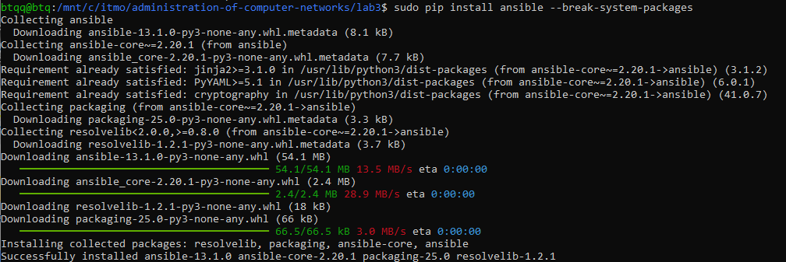

Создаем базовый конфиг файл, затем папку inventory и в ней файл с хостами

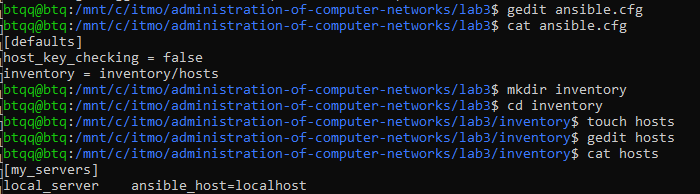

Проверяем, что Ansible подключился к "клиенту"

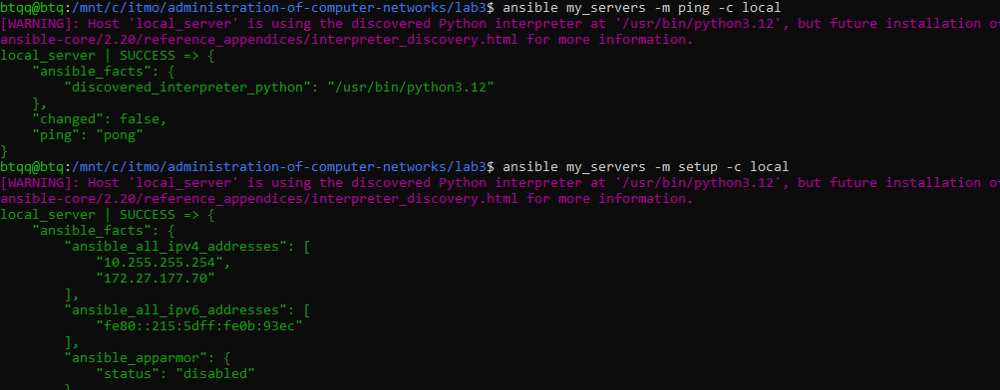

Всё успешно! Теперь пробуем выполнить базовые команды на клиенте.

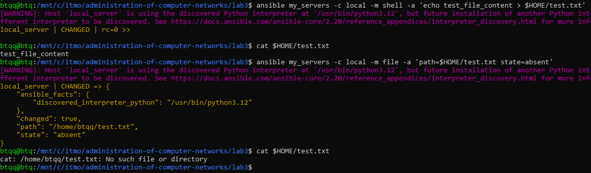

## Задание 1. Переписать пример с созданием и удалением файла с ad-hoc команд на плейбук формат, а так же добавить четвертый шаг - перед удалением поменять содержимое файла на любое другое.

Получился вот такой файл, который создает, меняет и удаляет файл, а затем проверяет, существует ли файл до сих пор:

```
---
- name: basic file operations
  hosts: my_servers
  connection: local
  gather_facts: no

  tasks:
    - name: create file
      shell: echo "test_file_content" > $HOME/test_from_playbook.txt
      args:
        executable: /bin/bash

    - name: verify file creation
      shell: cat $HOME/test_from_playbook.txt
      register: cat_result
      failed_when: cat_result.rc != 0
      
    - name: output cat
      debug:
        var: cat_result.stdout_lines

    - name: modify file content
      shell: echo "modified_file_content" > $HOME/test_from_playbook.txt
      args:
        executable: /bin/bash

    - name: verify file modification
      shell: cat $HOME/test_from_playbook.txt
      register: cat_mod_result
      failed_when: cat_result.rc != 0
      
    - name: output cat
      debug:
        var: cat_mod_result.stdout_lines

    - name: delete the file
      file:
        path: $HOME/test_from_playbook.txt
        state: absent

    - name: verify deletion
      stat:
        path: $HOME/test_from_playbook.txt
      register: stat_result

    - name: output stat
      debug:
        var: stat_result.stat.exists
```

Результат работы файла:

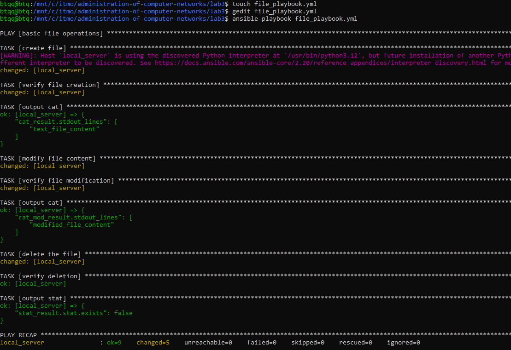

Всё работает!

## Часть 2. Установка Caddy

В рабочей директории создаем папку roles и инициализируем Caddy.

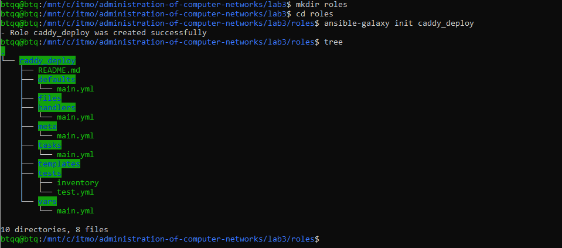

После этого заполняем плейбуки как в туториале. Проверяем, что всё работает.

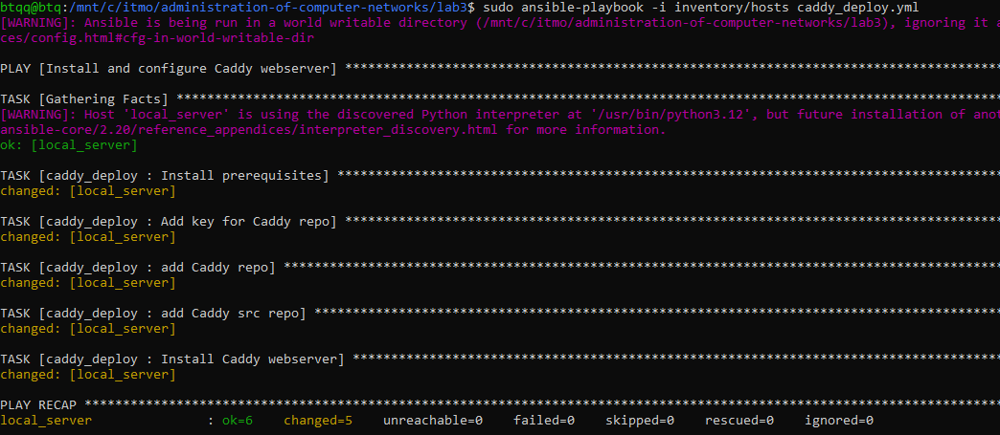

Всё работает! 


Ура! Самая легкая часть выполнена.

## Часть 3. Домен и настройка Caddyfile

Регистрируем домен на `https://www.duckdns.org/domains`

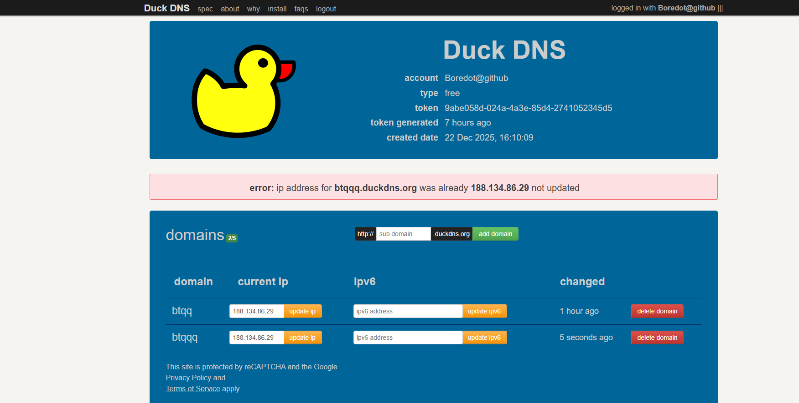

<details>
<summary>2 домена??</summary>

Вы можете спросить, а почему 2 домена? Я переделываю эту лабу, т.к. первый раз пытался сделать её на арче и почему-то у меня ничего не работало. Проблемы начались ещё в прошлой части, т.к. у меня в системе не было apt, только pacman, поэтому пришлось переписывать roles/main.yml. А потом были беды с открытием портов и порт форвардингом, поэтому решил всё просто переделать во второй раз в WSL.

</details>

Создаем шаблон и переменные и добавляем в плейбук шаги отвечающие за создание конфигурационного файла.

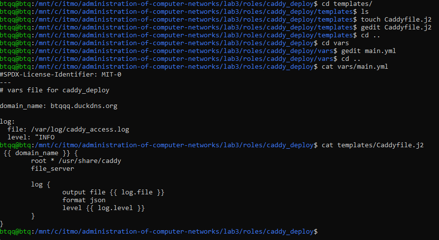

<details>
<summary>беды...</summary>

Этого нет в лабе, но на этом этапе у меня ничего не работало и я очень долго пытался всё починить. сначала жаловался на доступ к папке в которой должны лежать логи. Потом были проблемы с сертификатами let's encrypt. оказалось, что дело было в том, что не открыты порты. Но открыть порты для WSL не так уж и просто, надо получить внутренний IP и перенаправлять на него правилом netsh. А потом оказалось, что и этого недостаточно, надо сделать port forwarding. И даже после этого ничего не заработало. Почему? Я не знаю. НО после перезагрузки ПК всё магическим образом починилось. Честно, без понятия почему у меня всё было сломано, но ладно, главное, что теперь всё работает.

</details>

Ураа, всё работает!!

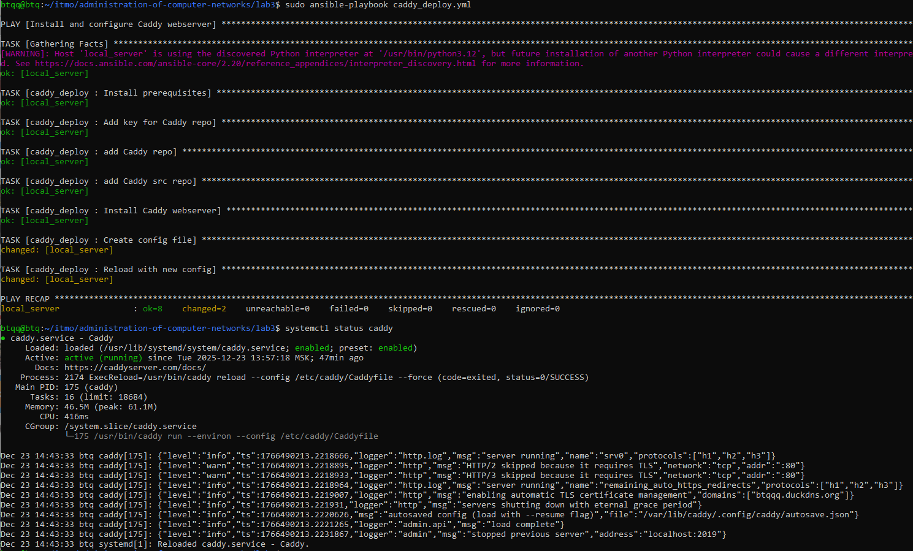

И сам сайт


## Задание 2а. Расширить конфиг Caddy

Я решил немного расширить конфиг, добавил headers и реализовыал все параметры передающиеся в Caddyfile через vars/main.yml

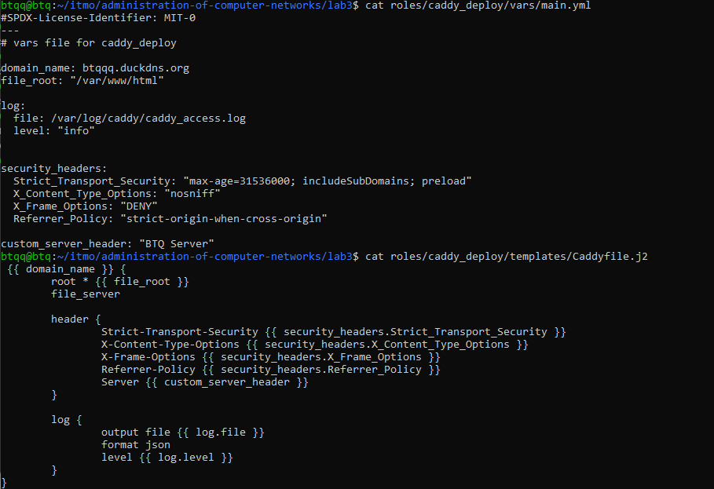

Вот, как после deploy выглядит Caddyfile и попытка curl

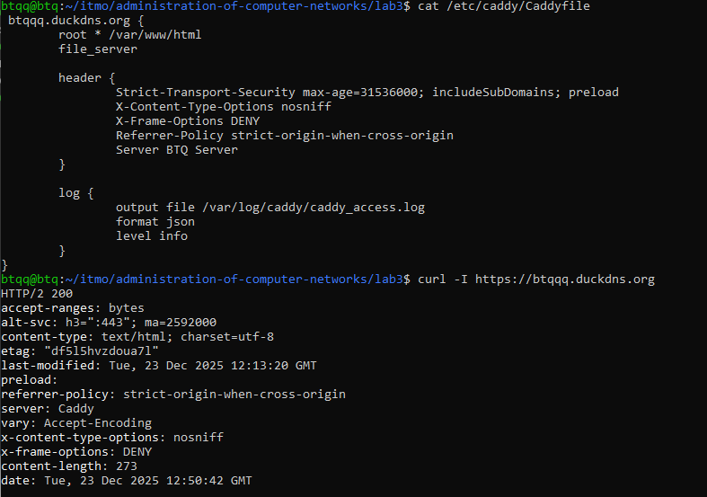

Ну и конечно же, Hello, World!

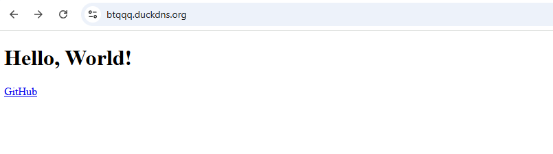

## Выводы

Если нет никаких проблем с подключением и портами, Caddy - очень удобный инструмент, позволяющий гибко настраивать сайт и удобно вносить изменения.
